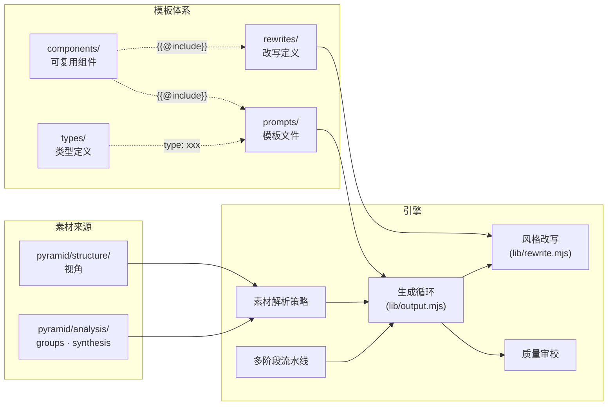

# 产出（Outputs）

基于 [pyramid/structure/](../pyramid/structure/) 视角生成的面向读者的内容。

## 架构概览



## 目录结构

```
outputs/
  README.md           # 本文件
  INDEX.md.tpl        # 产出索引模板
  _templates/         # 知识库自定义模板区（init 时复制到知识库）
    components/       #   自定义组件占位
    types/            #   自定义类型占位
    rewrites/         #   自定义改写定义占位
  components/         # 通用基础组件（非内容特定）
    constraints.md    #   全局硬性约束
    review/           #   审校组件
      base.md
    persona/          #   人设脚手架
      _scaffold.md
    style/            #   风格脚手架
      _scaffold.md
  types/              # 类型脚手架
    _scaffold.md
  prompts/            # 模板脚手架
    _scaffold.md
  rewrites/           # 改写脚手架
    _scaffold.md
```

> 具体的人设、风格、类型、模板和改写定义由技能引导创建，保存到知识库的 `outputs/_templates/` 目录下。
> 参见 `prism-template-author` 和 `prism-rewrite-author` 技能。

## 模板查找优先级

引擎加载模板、组件和类型时按以下顺序查找，找到即停：

| 资源 | 查找路径 |
| ---- | ---- |
| 模板 | `{baseDir}/outputs/_templates/*.md` |
| 组件 | `{baseDir}/outputs/_templates/components/` → 工具内置 `components/`（constraints.md, review/base.md） |
| 类型 | `{baseDir}/outputs/_templates/types/` |
| 改写 | `{baseDir}/outputs/_templates/rewrites/` |

知识库的 `_templates/` 优先。工具仅内置通用基础组件（`constraints.md`、`review/base.md`），所有内容特定的模板、人设、风格、类型和改写定义均由技能引导创建并保存在知识库中。

## 核心概念

### 组件（Components）

可复用的 Prompt 片段，通过 `{{@include path}}` 语法在模板中引用。

- `constraints.md` — 全局硬性约束（不编造、精确链接等），几乎所有模板共用
- `persona/` — 人设定义（技术博主、教程作者等）
- `style/` — 风格定义（叙事驱动、结构化教程等）
- `review/` — 审校标准

### 类型（Types）

产出的结构契约，声明读者画像、拆分粒度、变量需求和质量标准。

模板通过 frontmatter `type: diary` 引用类型，继承类型的默认配置（split、fileNaming 等），模板级可覆盖。

### 模板（Prompts）

实际的 Prompt 模板文件，包含最多五个区段：

| 区段 | 必需 | 说明 |
| ---- | ---- | ---- |
| `# System Prompt` | 是 | LLM 系统提示（人设、风格、约束） |
| `# Unit Prompt` | 是 | 每个产出单元的用户提示（含变量占位符） |
| `# Skeleton Template` | 否 | 骨架文件正文模板 |
| `# Review Prompt` | 否 | 质量审校提示（`--review` 时使用） |
| `# Stage: <name>` | 否 | 多阶段流水线的各阶段提示 |

### 改写（Rewrites）

已生成产出的风格变换定义。与模板不同，改写接受一篇已有文章作为输入，输出风格改写后的版本。

改写定义包含最多两个区段：

| 区段 | 必需 | 说明 |
| ---- | ---- | ---- |
| `# Rewrite Prompt` | 是 | 改写提示词，使用 `{{article_content}}` 和 `{{source_context}}` 变量 |
| `# Review Prompt` | 否 | 改写后信息保留度审校（`--review` 时使用） |

Frontmatter 字段：`name`、`description`、`platform`（wechat/zhihu/twitter/generic）、`preserveStructure`、`preserveLinks`、`preserveFrontmatter`。

改写结果写入原产出目录的 `_rewrites/<style>/` 子目录，不覆盖原文。

### 素材拆分粒度（Split）

| 值 | 说明 | 产出文件数 |
| ---- | ---- | ---- |
| `per-kl` | 每个 Key Line 一篇（默认） | N（KL 数量） |
| `per-perspective` | 整个视角一篇 | 1 |
| `per-group` | 每个 Group 一篇 | M（Group 数量） |

### 素材来源（Source）

| 来源类型 | 说明 |
| ---- | ---- |
| 单一视角 | 默认：`--perspective P01-xxx` |
| 多视角交叉 | `--perspective P01,P02` 或 frontmatter `source.type: cross-perspective` |
| 直接从 analysis | `--source analysis --groups G01,G02` |

## 新建产出流程

1. 确认素材就绪（视角已完成 scqa + tree，或 analysis groups 已充实）
2. 选择或创建类型定义（`types/`）
3. 创建 Prompt 模板（`prompts/`），引用组件和类型
4. 生成骨架：`output --skeleton --perspective ... --template ...`
5. 人工审查骨架
6. 生成产出：`output --perspective ... --template ...`
7. 可选审校：`output --perspective ... --template ... --review`
8. 可选改写：`rewrite --style kzk-wechat --dir outputs/<template>/<perspective>/`
9. 更新 [INDEX.md](INDEX.md) 的产出总览表

## CLI 参考

```
js-knowledge-prism output [选项]

--perspective <dir>  视角目录名（逗号分隔多个）
--template <name>    输出模板名
--output-dir <dir>   输出目录
--kl <id,...>        只处理指定 KL
--source <type>      素材来源（analysis）
--groups <ids>       指定 groups（配合 --source analysis）
--skeleton           只生成骨架
--validate           验证骨架引用
--dry-run            只预览
--force              覆盖已完成文件
--review             LLM 审校
--rewrite <style>    生成后自动执行风格改写
--stage <name>       从指定流水线阶段开始
--list-templates     列出可用模板
--list-types         列出可用类型
```

```
js-knowledge-prism rewrite [选项]

--style <name>       改写风格名
--file <path>        改写单个文件
--dir <path>         批量改写目录
--output-dir <dir>   自定义输出目录（默认 _rewrites/<style>/）
--force              覆盖已存在的改写结果
--review             改写后审校
--dry-run            只预览
--list-styles        列出可用改写定义
```
